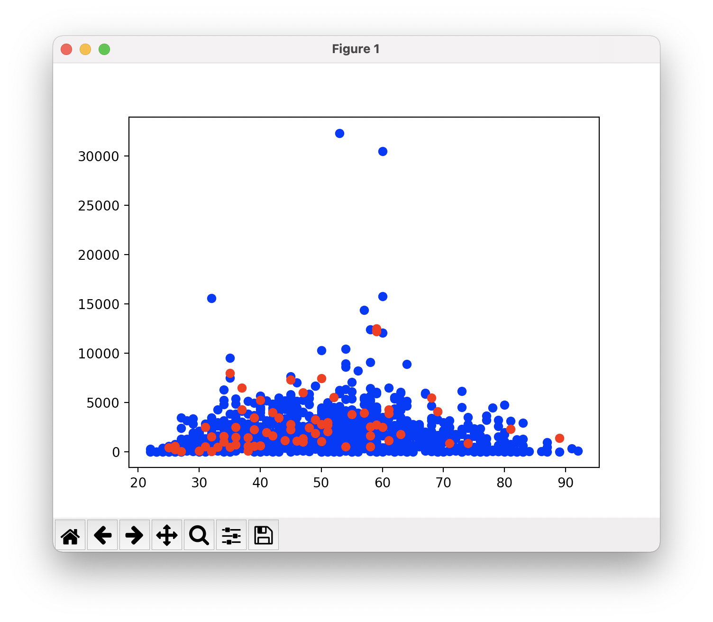
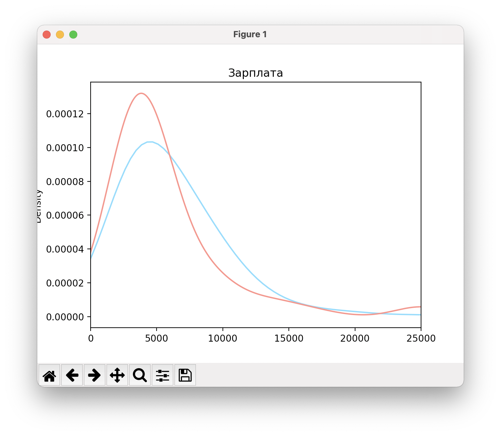
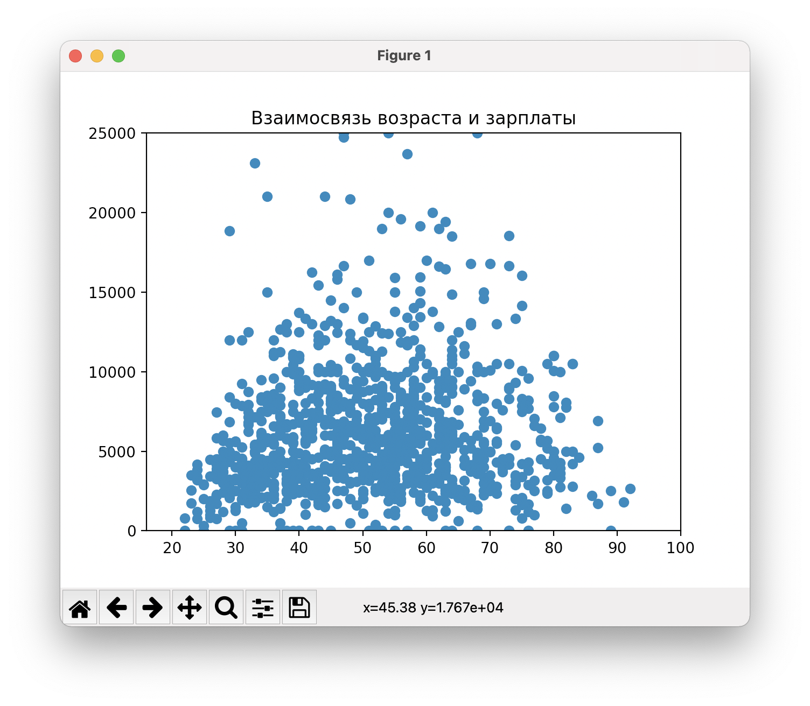
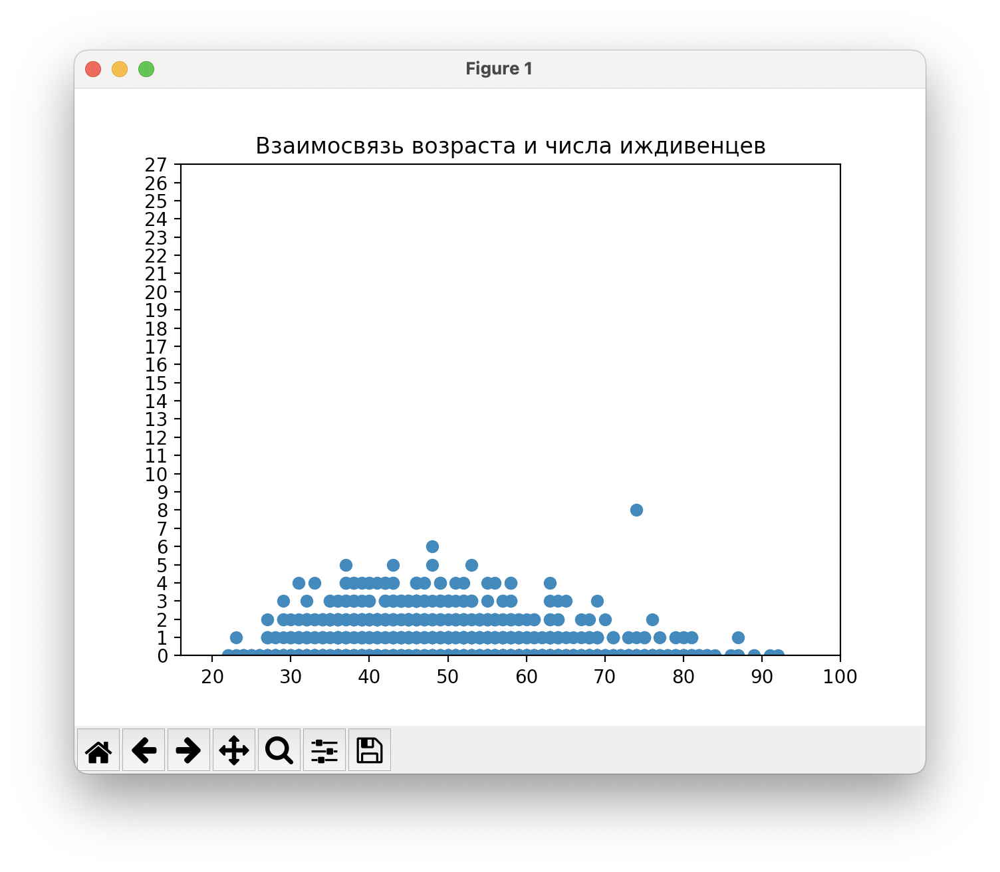

# Запуск

На Linux/macOS: 

`python3 main.py`

# Исходный код

Файл `main.py`

# Графики

#### График рассеяния (ось x - age, y - Debt)

#### Постройте на одном графике две нормированные плотности распределения: красную – для месячного дохода клиентов с задолженностями, синюю – для месячного дохода клиентов без задолженностей. По оси абсцисс отобразите значения до 25000.

#### Визуализируйте попарные зависимости между небинарными признаками 'age', 'MonthlyIncome', 'NumberOfDependents'. Ограничьте при этом месячный доход значением 25000.

(отсутствует)

(похоже на гауссова распределение)

(cвязи похоже нет, кроме как возможное падение числа иждивенцев при увеличении зарплаты свыше 15к руб.)